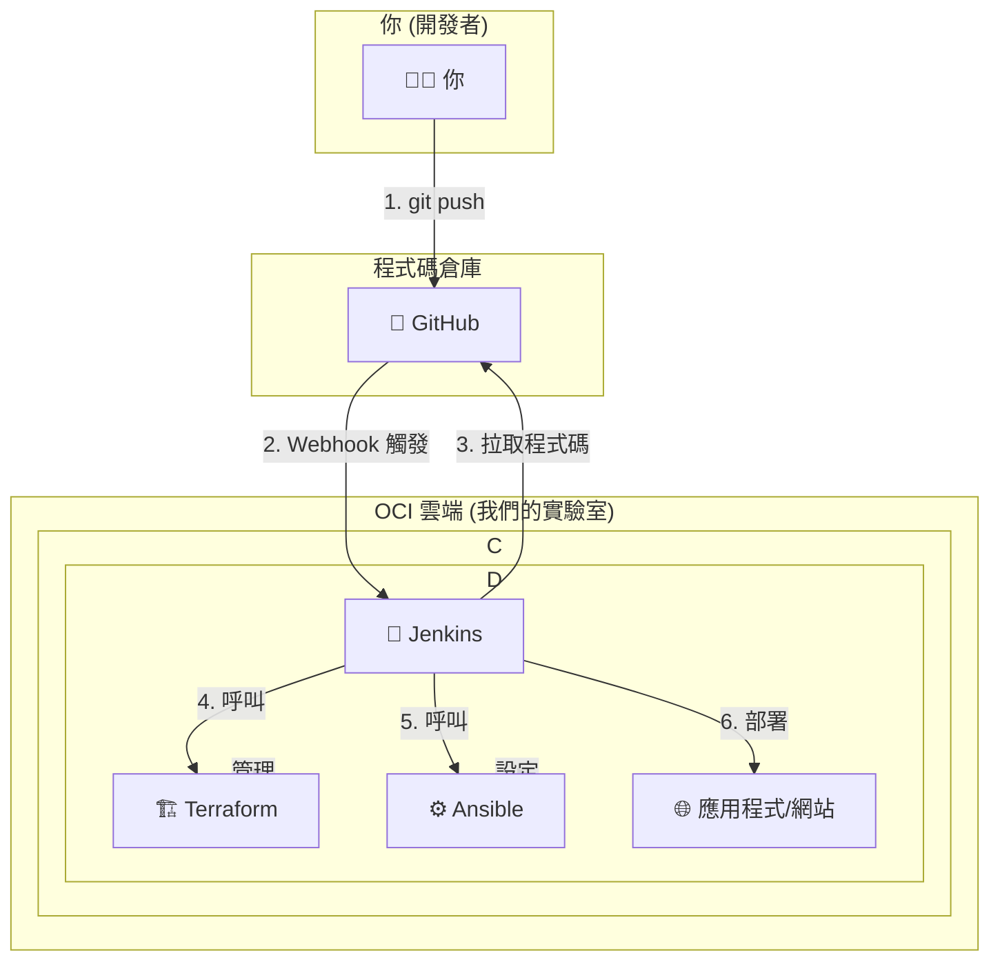

# IAC-CICD-LAB

藍圖：

架構圖步驟詳解

這張圖看起來可能有點複雜，我們一步一步把它拆解來看，其實很簡單：

    推送程式碼 (git push)

        你 (👨‍💻) 在自己的電腦上寫好程式碼 (例如：一個簡單的 HTML 網站)，然後使用 git push 指令把它上傳到 GitHub (🐙)。

    觸發 (Webhook Trigger)

        GitHub 收到你的程式碼後，會透過一個叫做 "Webhook" 的機制，自動發送一個通知給我們安裝在 OCI 主機上的 Jenkins (🤖)。

        (你可以把 Webhook 想像成：你在網購平台下單後，系統自動發送一封訂單通知信給倉庫一樣。)

    拉取程式碼 (Pull Code)

        Jenkins (🤖) 收到通知後，就會立刻從 GitHub (🐙) 上把你最新的程式碼下載到 OCI 主機上。

    基礎設施即程式碼 (IaC)

        Jenkins 會先執行 Terraform (🏗️) 的指令。Terraform 會檢查我們在程式碼中定義的雲端環境（例如：主機規格、網路設定）是否和 OCI 上實際的環境一致，如果不一致就會自動修正。

    組態管理 (Configuration Management)

        接著，Jenkins 會執行 Ansible (⚙️) 的指令。Ansible 會確保主機上的軟體都安裝並設定妥當 (例如：安裝 Nginx 網頁伺服器、設定防火牆等)。

    部署應用程式 (Deploy)

        最後，Jenkins 會把你的網站檔案複製到網頁伺服器的正確位置，完成部署。你的 應用程式/網站 (🌐) 就成功上線或更新了！
